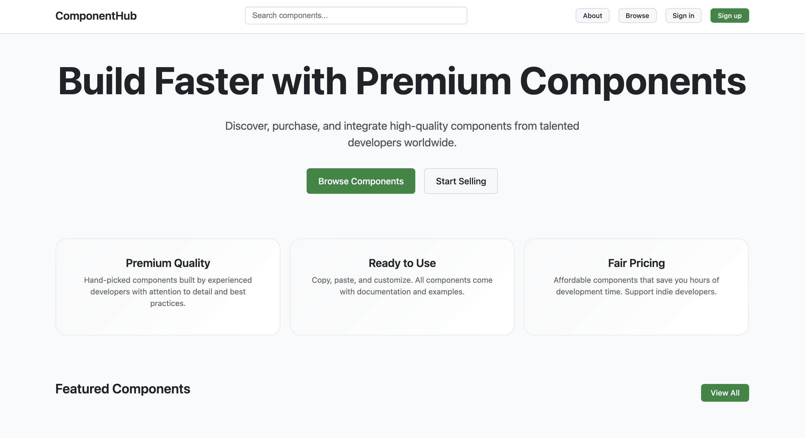

# ComponentHub – Reusable UI Component Platform

ComponentHub is a developer productivity platform that provides a centralized library of reusable UI components.
Developers can preview, customize, and export production-ready React components to accelerate frontend development.

The platform is built using the **MERN stack** with a scalable frontend architecture and backend API services.

---

#  Project Overview

Modern frontend projects often repeat UI components like buttons, cards, modals, and forms.

ComponentHub solves this problem by providing:

• A centralized UI component library
• Live component preview
• Real-time customization
• Exportable production-ready code

This improves **developer productivity and UI consistency**.

---

#  System Architecture

Frontend (React)

• Component library UI
• Dynamic component preview
• Code export feature
• Responsive design

Backend (Node.js + Express)

• API for component data
• Component metadata management
• Authentication support
• Secure API architecture

Database

• MongoDB stores component metadata and configuration.

---

# Tech Stack

Frontend

• React.js
• JavaScript (ES6+)
• Tailwind CSS
• HTML5
• CSS3

Backend

• Node.js
• Express.js
• REST API architecture

Database

• MongoDB

Tools

• Git
• GitHub
• Postman
• VS Code

---

#  Core Features

Reusable Component Library
Centralized collection of UI components.

Live Component Preview
Developers can preview components dynamically.

Real-time Customization
Users can modify styles and properties instantly.

Code Export Feature
Automatically generates reusable component code.

Modular Architecture
Designed using reusable component patterns.

---

#  Project Structure

ComponentHub
│
├── client
│   ├── src
│   │   ├── components
│   │   │   ├── Button
│   │   │   ├── Card
│   │   │   ├── Navbar
│   │   │   └── Modal
│   │   │
│   │   ├── pages
│   │   ├── hooks
│   │   ├── utils
│   │   └── App.js
│
├── server
│   ├── routes
│   ├── controllers
│   ├── models
│   ├── middleware
│   └── server.js
│
└── package.json

---

# 🔌 API Design

Example API endpoint

GET /api/components

Returns list of available UI components.

Example response

{
"name": "Button",
"category": "UI",
"framework": "React",
"styles": ["primary","outline"]
}

---

# 📸 Screenshots

Home Page

Component Library

Component Preview

---

# ⚙ Installation & Setup

Clone the repository

git clone https://github.com/senthilnathan-2004/ComponentHub.git

Move to project directory

cd ComponentHub

Install dependencies

npm install

Run frontend

npm start

Run backend server

node server.js

Open browser

http://localhost:3000

---

#  Future Improvements

• Component search functionality
• Component documentation system
• Dark mode support
• Authentication system
• Component versioning

---

#  Author

Senthilnathan R

GitHub
https://github.com/senthilnathan-2004

LinkedIn
https://linkedin.com/in/senthilnathan--r

Portfolio
https://senthilnathan-2004.github.io/sen_pro
